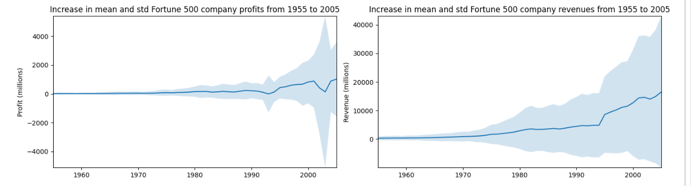
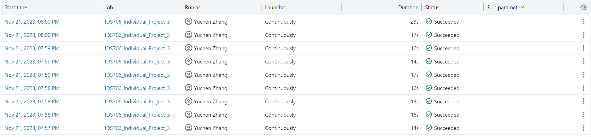

[](https://github.com/nogibjj/IDS706_Fall2023_Project_3_Databricks_ETL_Pipiline/actions/workflows/install.yml)
[](https://github.com/nogibjj/IDS706_Fall2023_Project_3_Databricks_ETL_Pipiline/actions/workflows/lint.yml)
[](https://github.com/nogibjj/IDS706_Fall2023_Project_3_Databricks_ETL_Pipiline/actions/workflows/format.yml)
[](https://github.com/nogibjj/IDS706_Fall2023_Project_3_Databricks_ETL_Pipiline/actions/workflows/test.yml)
# IDS706 Fall 2023 Project 3 Databricks ETL Pipeline

Fall 2023 IDS_706 Data Engineering Systems Individual Project 3: Databricks ETL (Extract Transform Load) Pipeline

It contains:

- ``IDS706_Individual_Project_3.ipynb`` an Azure Databricks-based Jupyter Notebook that makes use of ``Pandas`` to perform descriptive statistics related to the revenue data of fortune 500 companies over 50 years

- ``.devcontainer`` includes a `Dockerfile` that specifies the configurations of container, and a `devcontainer.json` which is a configuration file used in the context of Visual Studio Code

- ``workflows`` includes `GitHub Actions`, enables automated build, test and deployment for the project

- ``Makefile`` specifies build automation on Linux

- ``requirements.txt`` lists the dependencies, libraries, and specific versions of Python packages required for the project

It also includes ``main.py`` and ``test_main.py`` as sample files to show the functionality of the CI pipeline.

## How to run the notebook
All the input/output data has been configured into ``Delta Lake`` storage, making the dependencies minimal to use. To run the notebook, just find the notebook on the ``Databricks Workspace`` and hit ``Run All``.

## Databricks data pipeline

The Azure Databricks notebook contains a data pipeline that contains a **data source**, a data processing script and a **data sink**.

### Usage of Delta Lake storage
Configure the data source as below to read data from Delta Table.
```Python
# Define variables used in code below
file_path = "/databricks-datasets/structured-streaming/events"
username = spark.sql("SELECT regexp_replace(current_user(), '[^a-zA-Z0-9]', '_')").first()[0]
table_name = f"{username}_etl_quickstart"
checkpoint_path = f"/tmp/{username}/_checkpoint/etl_quickstart"

# Clear out data from previous demo execution
spark.sql(f"DROP TABLE IF EXISTS {table_name}")
dbutils.fs.rm(checkpoint_path, True)

# Configure Auto Loader to ingest JSON data to a Delta table
(spark.readStream
  .format("cloudFiles")
  .option("cloudFiles.format", "json")
  .option("cloudFiles.schemaLocation", checkpoint_path)
  .load(file_path)
  .select("*", col("_metadata.file_path").alias("source_file"), current_timestamp().alias("processing_time"))
  .writeStream
  .option("checkpointLocation", checkpoint_path)
  .trigger(availableNow=True)
  .toTable(table_name))
```

#### Benefits of using Delta Lake
Delta Lake provides several benefits over traditional file-based storage systems, such as:

- ``ACID transactions``: Delta Lake asset transactions perform atomic, consistent, isolated, and durable (ACID) operations on data. This means that data integrity is maintained even in the presence of multiple writers and concurrent tasks.

- ``Schema enforcement``: Delta Lake enforces schema validation and schema evolution on write. This means that even messy data sources will have a consistent schema. And if a change in schema is needed, it can be done on write time to avoid issues.

- ``Optimistic concurrency control``: Delta Lake optimizes writes to handle the concurrent tasks of multiple users while maintaining data consistency.

- ``Time travel``: Delta Lake allows rollbacks, offering version control of data and the ability to access previous versions of tables.

- ``Data versioning``: Delta Lake maintains multiple versions of a table, so users can retrospectively review the dataset and see changes over time.

- ``Metadata management``: Delta Lake manages metadata, providing users with more information and control over the lifecycle of a table.

### Usage of Spark SQL for data transformations
First, create a ``Spark`` session
```Python
    spark = SparkSession.builder.appName("example").getOrCreate()
```
Then execute a ``Spark`` SQL query. It calculates the average of ``Data_value`` of alcohols whose ``Series_reference`` is ``ALCA.SAABS``.
```Python
    data_value = spark.sql(
        "SELECT AVG(Data_value) AS AvgValue FROM data WHERE Series_reference = 'ALCA.SAABS'"
    )
```

### Visualization of the transformed data
The notebook outputs a visualization of data indicating the increasing in mean and std Fortune 500 company profits for over 50 years.


### Automated trigger
``Databricks Jobs`` can be set up to initiate an automated trigger for the pipeline.


### Conclusion and Recommendation
Here is a summary of the main findings and some possible recommendations:<br>
The Fortune 500 is an annual ranking of the largest U.S. public companies by revenue. The list has changed significantly over the years, reflecting the dynamic nature of the U.S. economy and the rise and fall of different industries and firms.<br>
Corporate pretax profits surged 25% year over year to $2.81 trillion, the largest annual increase since 1976. When taxes are factored in, last year’s corporate profit increases were even more of an outlier. They soared 37% year over year, more than any other time since 1948.
The considerable jump in corporate profits highlights how businesses have passed off rising production and supply costs to consumers and lends weight to criticism by top Democrats that outsize price hikes are at least partially responsible for rising inflation2. Consumer prices jumped 6.7% in 2021 and 7.9% year over year in February, the biggest gain since 1982.<br>
However, there is no clear correlation between corporate tax rates and economic growth or corporate profits over the past 60 years. Economic growth has actually been stronger when corporate tax rates were higher, according to the Economic Policy Institute. U.S. corporate tax rates also are not hurting profits — before-tax and after-tax corporate profits as a percentage of national income are at post–World War II highs.<br>
Some of the most profitable and fastest-growing companies on the Fortune 500 list are in the technology sector, such as Apple, Amazon, and Microsoft. These companies have benefited from the increased demand for online services, cloud computing, and digital devices during the pandemic. They have also invested heavily in innovation, research and development, and customer satisfaction.<br>